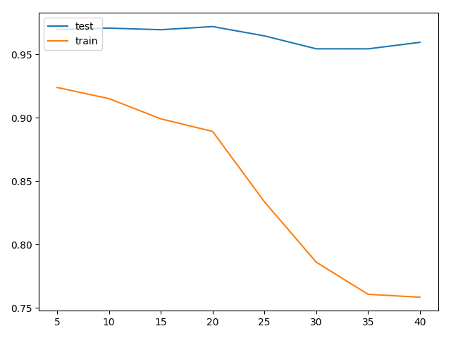

# Funk SVD
An attempt at implementing Funk SVD in Python. Using the ML-100K dataset, a RMSE of 0.95 is found with a latent
dimension size of 30. The optimization process is vanilla SGD. Only library used is numpy (and loguru for logging).

## Quickstart
Create a virtual environment and download requirements:
```
python3 -m venv .env
source .env/bin/activate

pip install --upgrade pip
pip install -r requirements.txt
```
Download the dataset:
```
python3 src/download_data.py
```
Run Funk SVD:
```
python3 src/funk_svd.py
```
This will combine all folds and train and try different latent dimensions on the ML-100K dataset.
Tested on `pip` version `pip 20.3.3` and `python` version `3.9`.

### Troubleshooting
Be sure not to download the dataset too often.
In some cases, you will be blocked from the MovieLens endpoint for issuing too many requests.
## Train and test RMSE
Train and test RMSE were compared with different latent dimensions sizes.
Increased latent dimension sizes cause lower training RMSE with little benefit to the test RMSE. Appears indicative that
the model can easily overfit with too many dimensions.


